# Let's Fix Step-by-Step: Iterative Refinement for Compositional Image and Video Generation

This repository contains code for compositional visual generation with iterative refinement:

- **Compositional image generation:** [`image_gen/inference_time_iterative_refinement`](image_gen/inference_time_iterative_refinement)
- **Compositional video generation:** [`video_gen/inference_time_iterative_refinement`](video_gen/inference_time_iterative_refinement)
- **Training-based step-by-step image generation:** [`image_gen/train_step_by_step_model`](image_gen/train_step_by_step_model)

The image and video inference code runs the test-time iterative refinement loop. The training code creates synthetic step-by-step supervision and trains a model to produce compositional images through staged additions. The video-generation code is experimental.

## Results

### Image Generation

| Baseline | Iterative Refinement |
| --- | --- |
| 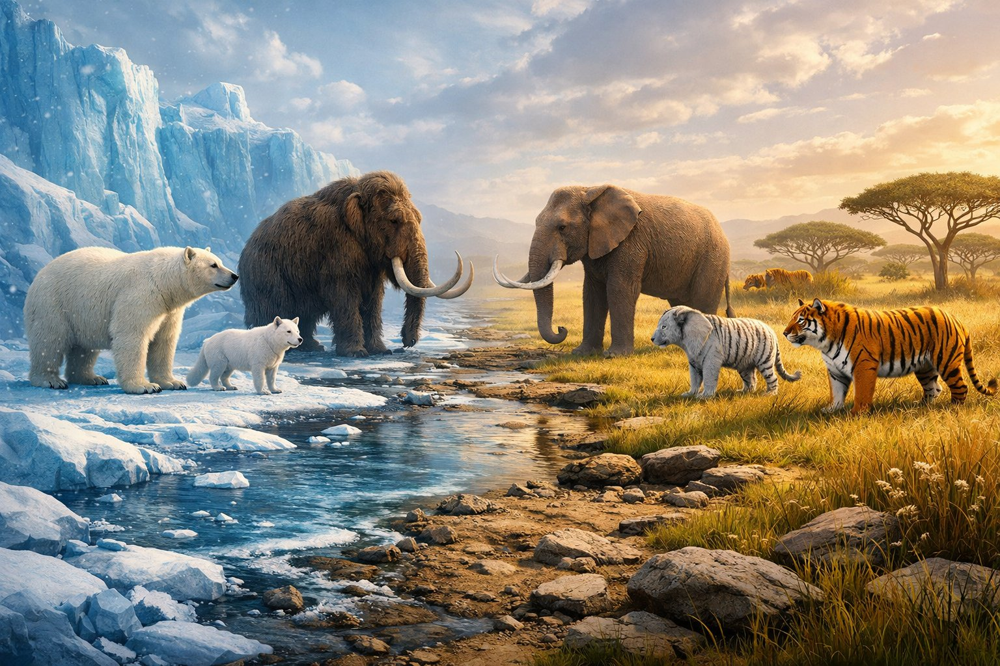 | 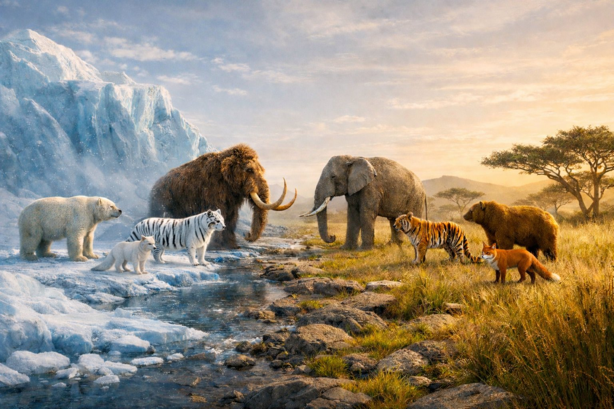 |

<p><sub><b>Prompt:</b> Glacier-to-savannah cinematic panorama: icy side (blue ice, snow) has polar bear, arctic fox, woolly mammoth, white tiger in a straight line; warm grassy side has brown bear, red fox, elephant, orange tiger aligned opposite, each facing its counterpart. Seamless transition, no barriers. Soft cinematic light, animated realism, epic scale.</sub></p>

| Baseline | Iterative Refinement |
| --- | --- |
| 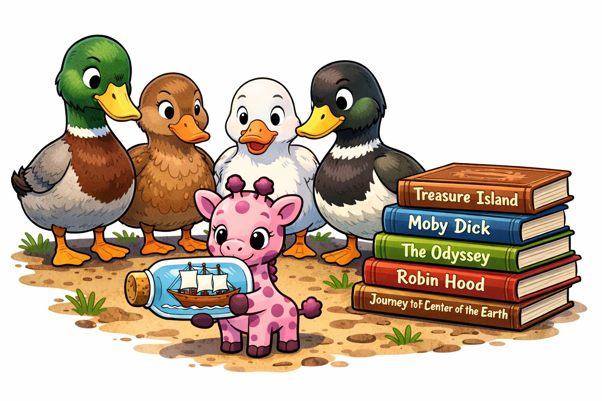 | 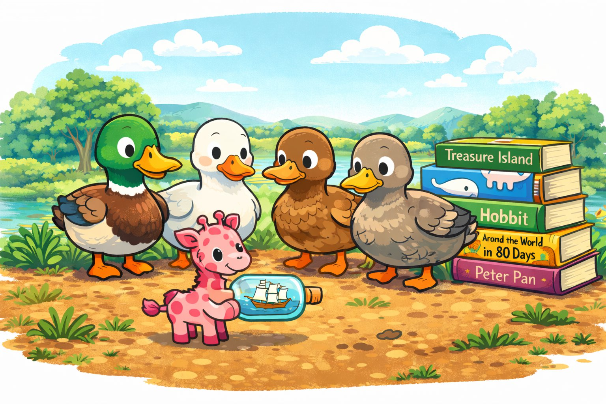 |

<p><sub><b>Prompt:</b> Four ducks are standing on the ground, and a tiny pink giraffe is standing in front of them holding a bottle with a ship inside it. Five novels are placed on the ground behind the ducks. The image is in a cartoon style.</sub></p>

<details>
<summary>Step-by-step trace: glacier-to-savannah panorama</summary>

| Step 0 | Step 1 | Step 2 |
| --- | --- | --- |
| 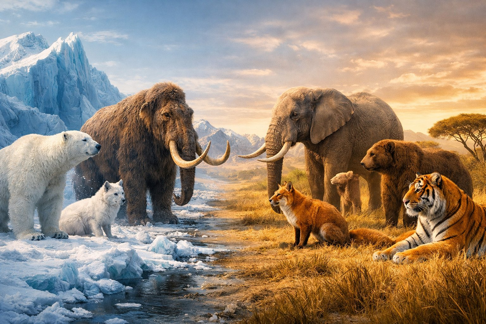 | 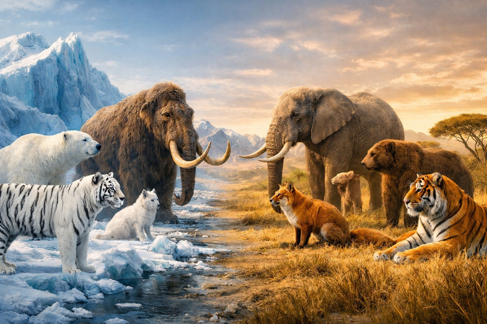 | 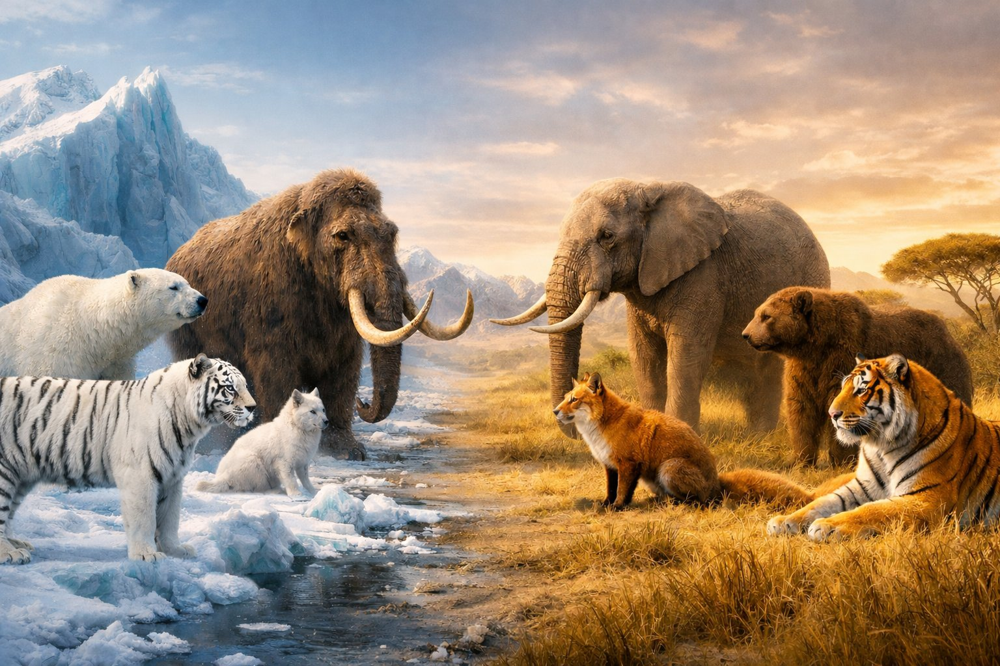 |
| <sub>Initial generation from the full glacier-to-savannah prompt.</sub> | <sub>Add a white tiger to the icy side and align the facing animal rows.</sub> | <sub>Remove the extra partial brown bear and keep the transition seamless.</sub> |

</details>

<details>
<summary>Step-by-step trace: ducks, giraffe, and novels</summary>

| Step 0 | Step 1 | Step 2 |
| --- | --- | --- |
| 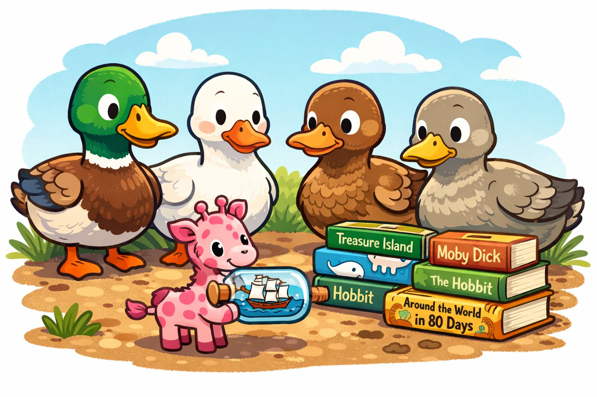 | 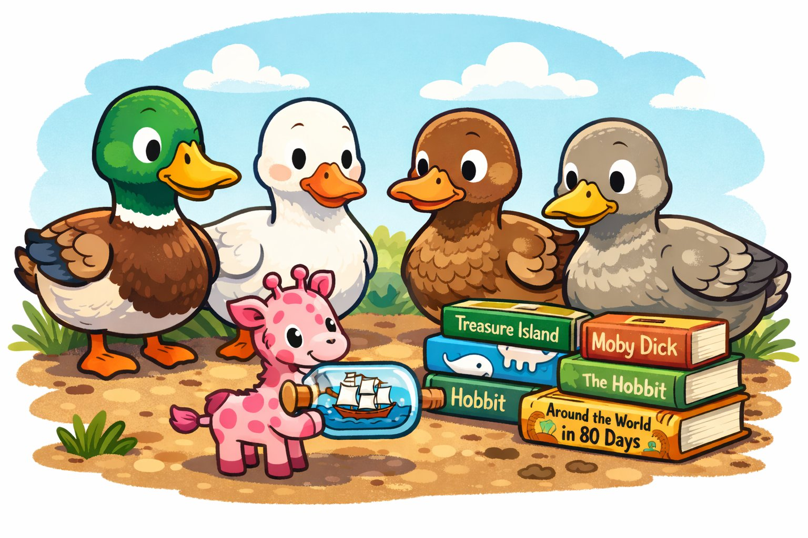 | 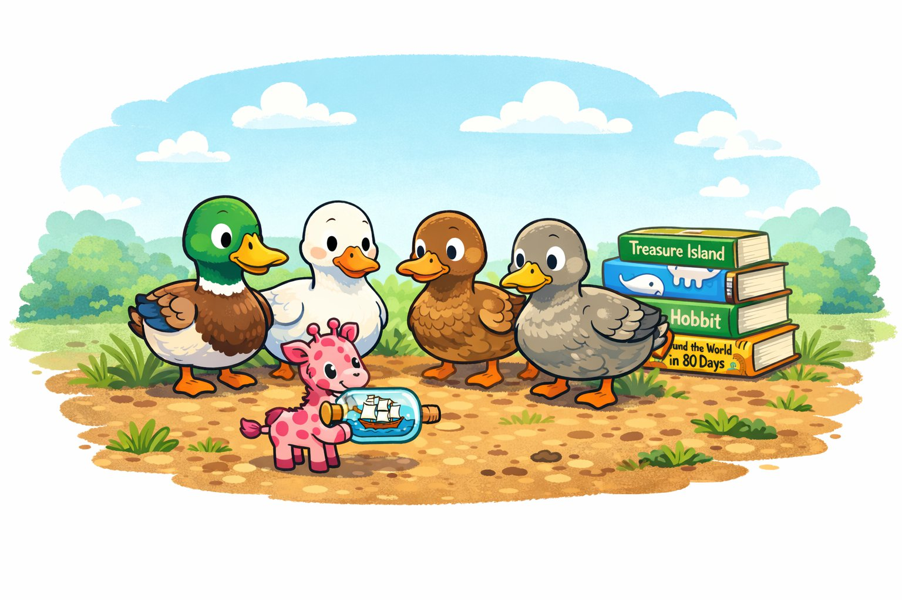 |
| <sub>Initial generation from the full duck, giraffe, bottle, and novel prompt.</sub> | <sub>Move the novels behind the ducks while preserving the other objects.</sub> | <sub>Make space behind the ducks for the novels.</sub> |

| Step 3 | Step 4 |
| --- | --- |
| 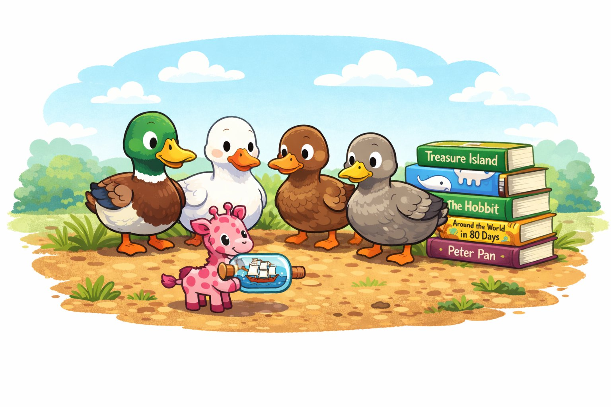 |  |
| <sub>Add one more novel so there are five total.</sub> | <sub>Refine the giraffe's bottle and preserve cartoon style.</sub> |

</details>

### Video Generation

| Baseline | Iterative Refinement |
| --- | --- |
| [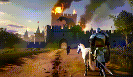](video_gen/inference_time_iterative_refinement/outputs/sample_outputs/case_1_knight_castle_horse_bird/parallel/sample_0.mp4) | [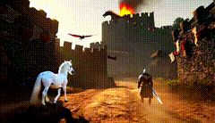](video_gen/inference_time_iterative_refinement/outputs/sample_outputs/case_1_knight_castle_horse_bird/trajectory_0/step_4_add2.mp4) |

<p><sub><b>Prompt:</b> A knight walking to a castle carrying a sword. A dragon emitting flames from its mouth sits on top of the castle. A red bird flying in the background. A white horse walking on left of the knight.</sub></p>

| Baseline | Iterative Refinement |
| --- | --- |
| [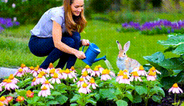](video_gen/inference_time_iterative_refinement/outputs/sample_outputs/case_2_garden_rabbit_butterfly/parallel/sample_0.mp4) | [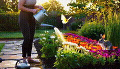](video_gen/inference_time_iterative_refinement/outputs/sample_outputs/case_2_garden_rabbit_butterfly/trajectory_0/step_2_add1.mp4) |

<p><sub><b>Prompt:</b> A woman is watering flowers in garden while rabbit watches and yellow butterfly flies around.</sub></p>

<details>
<summary>Step-by-step trace: knight, castle, horse, and red bird</summary>

| Step | Instruction | Video |
| --- | --- | --- |
| 0 | Original generation | [MP4](video_gen/inference_time_iterative_refinement/outputs/sample_outputs/case_1_knight_castle_horse_bird/trajectory_0/step_0_core.mp4) |
| 1 | Add a white horse walking on left of the knight. | [MP4](video_gen/inference_time_iterative_refinement/outputs/sample_outputs/case_1_knight_castle_horse_bird/trajectory_0/step_2_add1.mp4) |
| 2 | Add a red bird flying in the background. | [MP4](video_gen/inference_time_iterative_refinement/outputs/sample_outputs/case_1_knight_castle_horse_bird/trajectory_0/step_4_add2.mp4) |

</details>

<details>
<summary>Step-by-step trace: garden, rabbit, and butterfly</summary>

| Step | Instruction | Video |
| --- | --- | --- |
| 0 | Original generation | [MP4](video_gen/inference_time_iterative_refinement/outputs/sample_outputs/case_2_garden_rabbit_butterfly/trajectory_0/step_0_core.mp4) |
| 1 | Add a yellow butterfly flying around the garden. | [MP4](video_gen/inference_time_iterative_refinement/outputs/sample_outputs/case_2_garden_rabbit_butterfly/trajectory_0/step_2_add1.mp4) |

</details>

More sample outputs are included under each image/video generation directory's `outputs/sample_outputs/`.

### Training Step-by-Step Model

The training pipeline creates synthetic step-by-step examples by starting from a full generated image and progressively removing objects. The rightmost panel below is the original full image; the other panels are intermediate samples generated through object removal.


Example generations from a trained step-by-step FLUX LoRA model:

| Trained Model Example 1 | Trained Model Example 2 |
| --- | --- |
|  |  |

## Approach

<p align="center">
  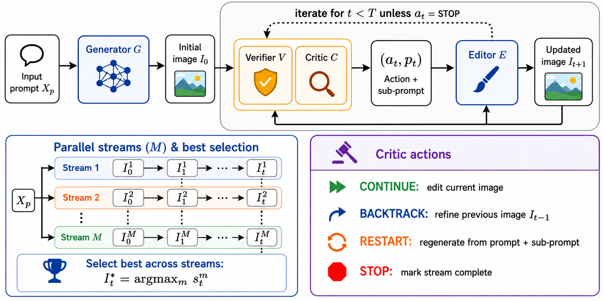
</p>

The core loop for test-time iterative refinement is simple:

1. Generate an initial image or video from the prompt.
2. Ask a VLM verifier yes/no questions about prompt satisfaction.
3. Ask a VLM critic to choose the next action, such as edit, regenerate, backtrack, or stop.
4. Apply the edit or regeneration with the selected generator/editor model.
5. Repeat for a fixed test-time budget and select the best candidate by verifier score.

For image generation, the runner supports Qwen Image, NanoBanana/Gemini image models, GPT Image, Flux Dev, and Flux Kontext style hosted endpoints. For video generation, the runner supports Wan text-to-video generation and UniVideo/Wan-style editing through Gradio endpoints. The video pipeline is experimental because current video editors can be sensitive to prompt structure, resolution, and model settings.

The training-based image code creates synthetic step-by-step image editing pairs: it generates full compositional images with FLUX, verifies/relabels them with Grounded-SAM2 and VQAScore, removes selected objects with Qwen-Image-Edit, and collates the results into image-to-image training triples for FLUX finetuning. **Note**: This rejection sampling approach through progressive removal of objects was done before capable open-source image editing models like Qwen-Image came out. One can now extend it to collect rejection sampling data by using a verifier/relabeller with progressive step-by-step Qwen-Image edits.

The FLUX training code includes LoRA step-by-step training with two condition-image injection modes: the default channel/projector adapter and a token-concatenation variant.

## Setup

Each directory has its own `setup.sh`; the image/video inference directories also provide Python package entry points, while the training directories provide launch scripts.

Image generation:

```bash
cd image_gen/inference_time_iterative_refinement
bash setup.sh
micromamba activate iterative-image-gen
```

Video generation:

```bash
cd video_gen/inference_time_iterative_refinement
bash setup.sh
micromamba activate iterative-video-gen
```

Training data generation (for step by step training):

```bash
cd image_gen/train_step_by_step_model/synthetic_data_creation
bash setup.sh
micromamba activate iter-refine-data-gen
```

Step-by-step FLUX training:

```bash
cd image_gen/train_step_by_step_model/model_training_scripts/x-flux
bash setup.sh
micromamba activate iter-refine-xflux
```

The image, video, and training READMEs include the model-server setup details for Qwen/vLLM-Omni, Wan, UniVideo, Grounded-SAM2, and VLM verifier/critic providers.

## Acknowledgements

This code builds on several open-source projects and model ecosystems:

- [vLLM](https://github.com/vllm-project/vllm) and vLLM-Omni for serving local image generation/editing models.
- Qwen Image/Qwen-Image-Edit, FLUX/FLUX Kontext, GPT Image, and Gemini image models as supported image generator/editor backends.
- Wan video models and [KlingAIResearch/UniVideo](https://github.com/KlingAIResearch/UniVideo) for the experimental compositional video generation pipeline.
- [XLabs-AI/x-flux](https://github.com/XLabs-AI/x-flux) and FLUX.1-dev for the FLUX LoRA/full-finetuning training code.
- [Grounded-SAM-2](https://github.com/IDEA-Research/Grounded-SAM-2) for object grounding and mask extraction during synthetic data creation.
- [VQAScore](https://github.com/linzhiqiu/t2v_metrics) for VQA-based rejection and relabeling.

## Citation

If you use this code or find it relevant to your work, please cite:

```bibtex
@article{jaiswal2026iterative,
  title={Iterative Refinement Improves Compositional Image Generation},
  author={Jaiswal, Shantanu and Prabhudesai, Mihir and Bhardwaj, Nikash and Qin, Zheyang and Zadeh, Amir and Li, Chuan and Fragkiadaki, Katerina and Pathak, Deepak},
  journal={arXiv preprint arXiv:2601.15286},
  year={2026}
}
```
