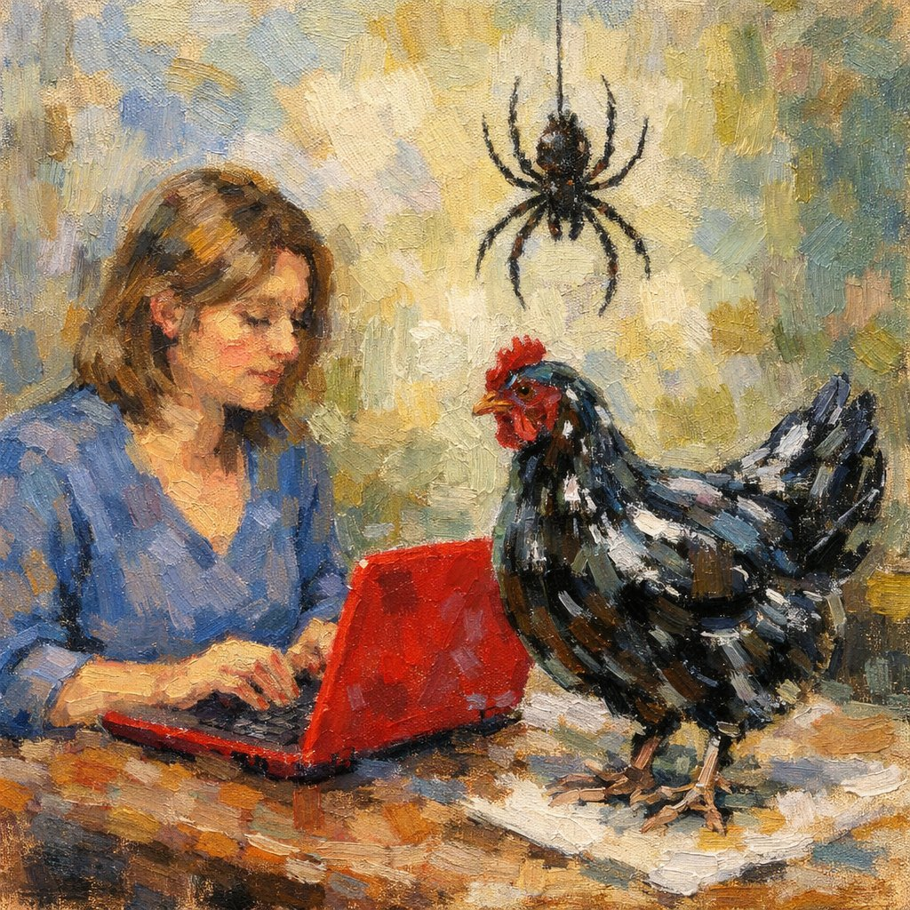
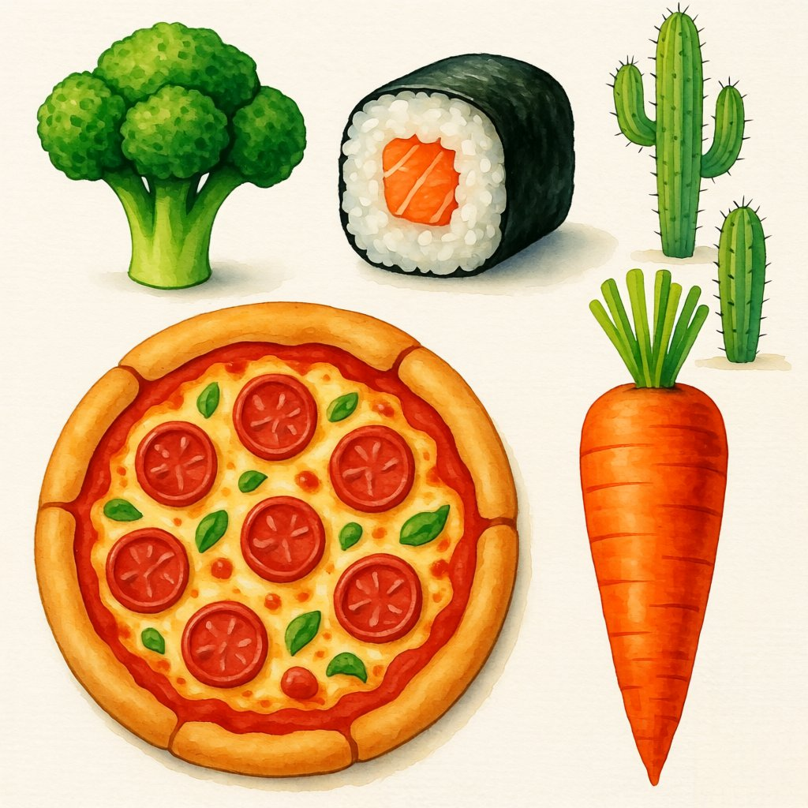
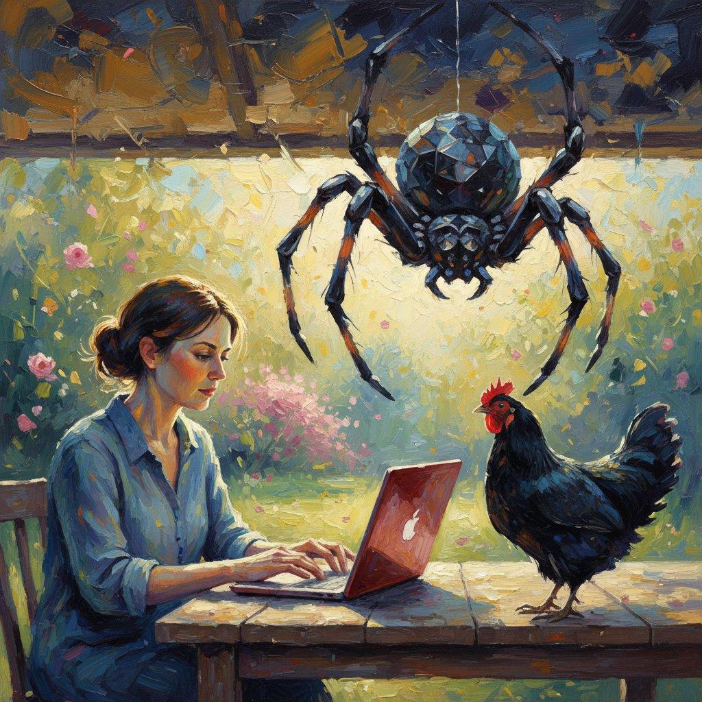
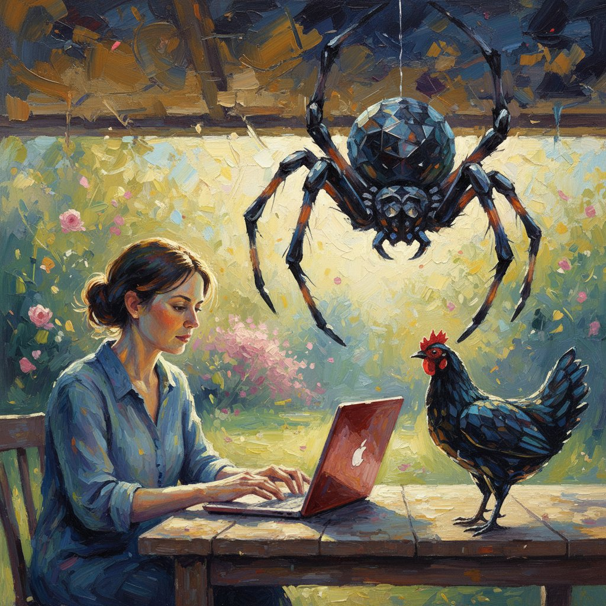
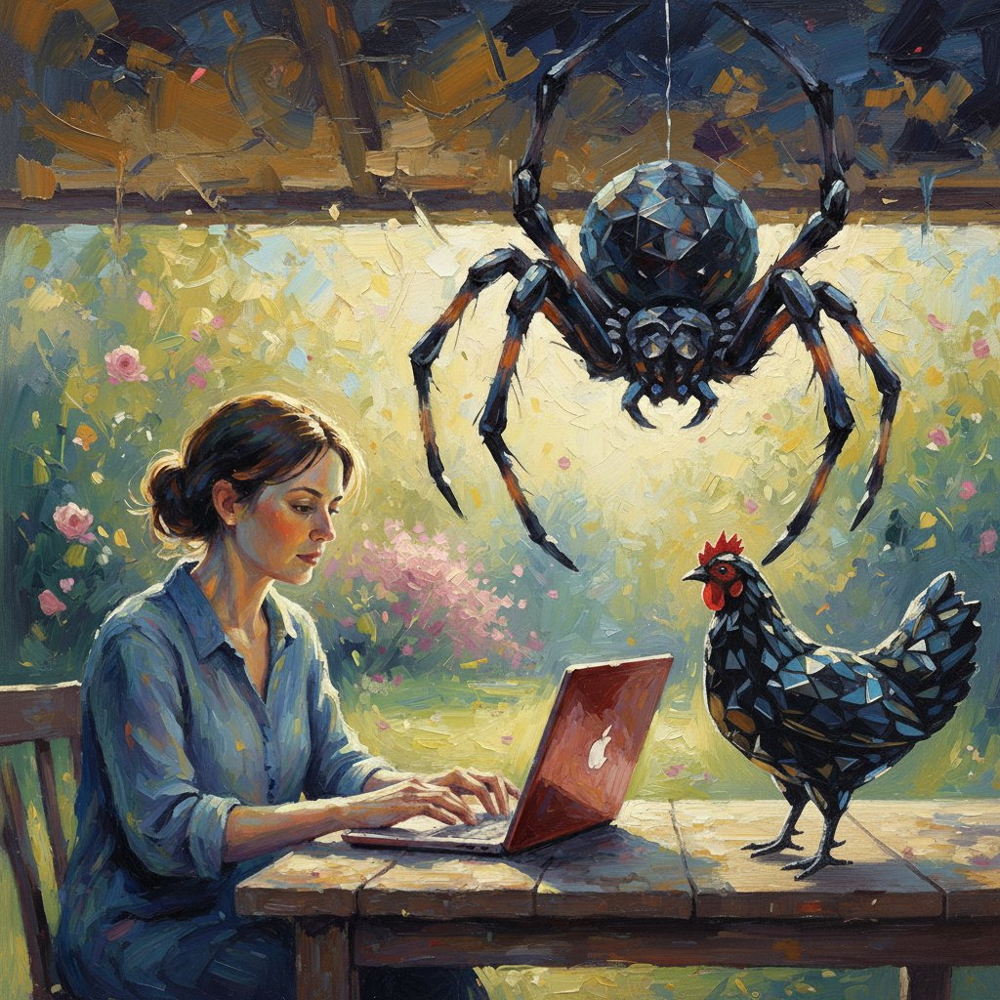
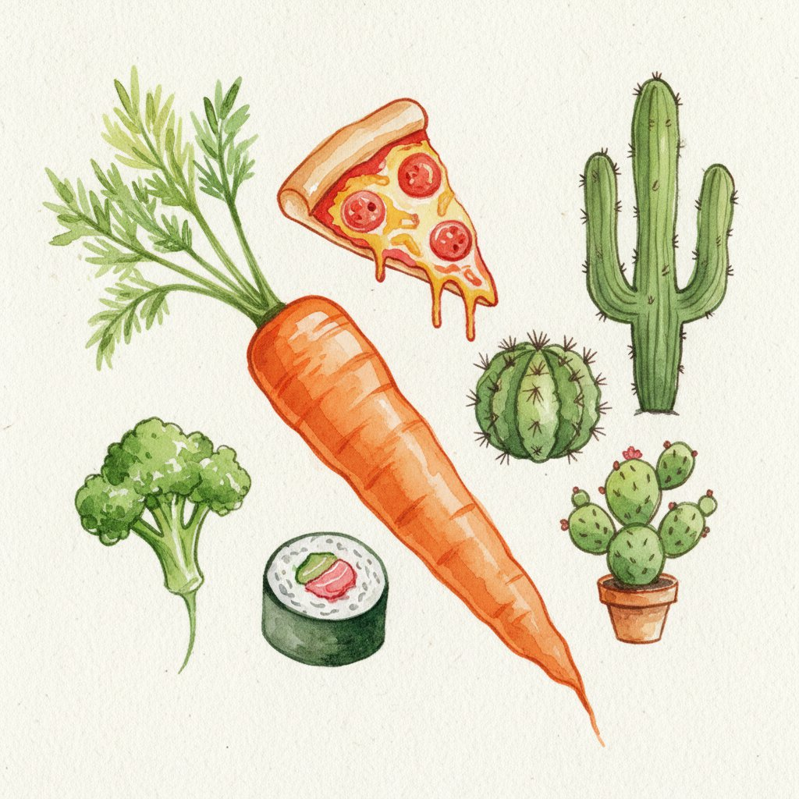
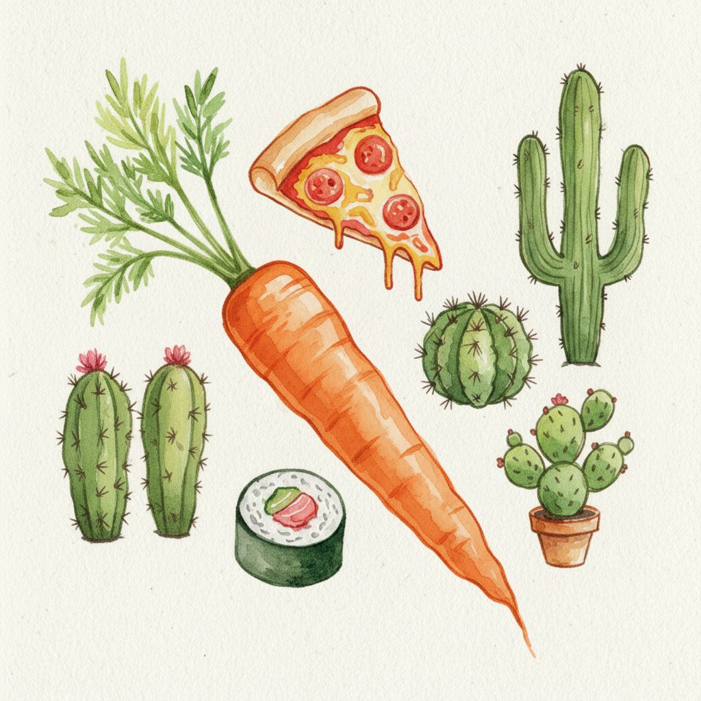
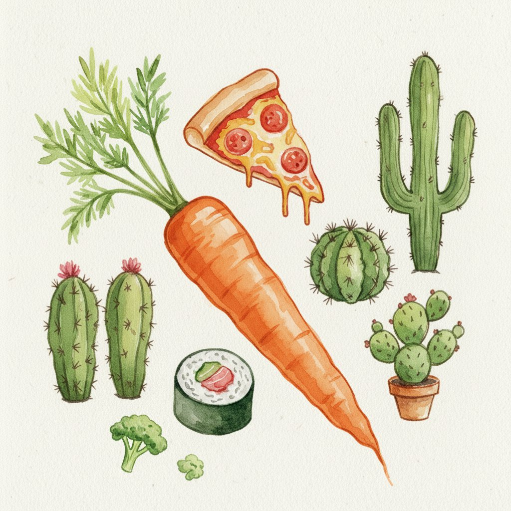
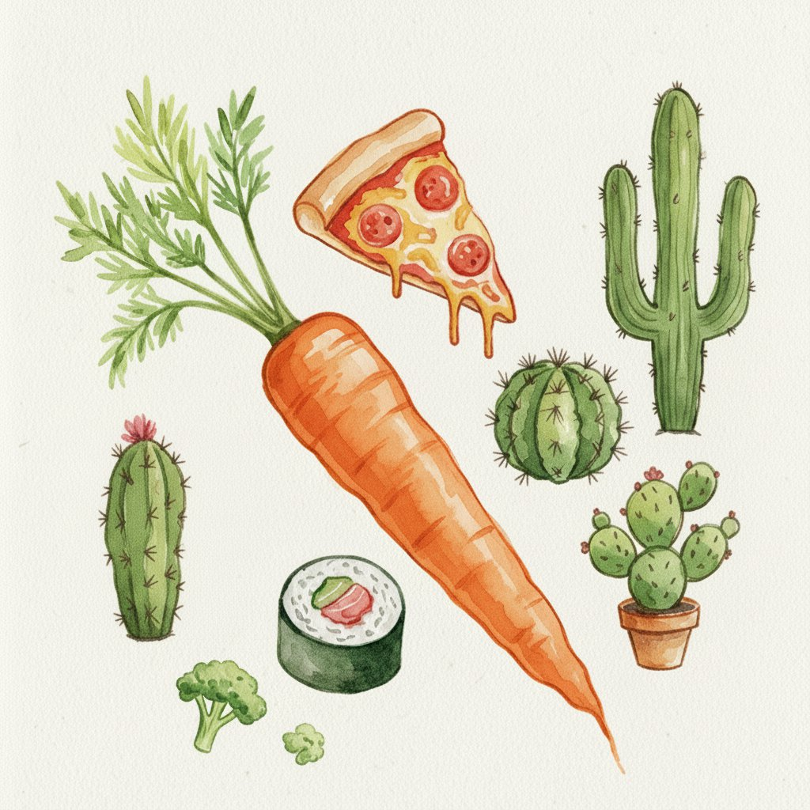

# Iterative Refinement for Compositional Image Generation

Code for running the method from "Iterative Refinement Improves Compositional Image Generation".

The core loop is:

1. Generate an initial image from the full prompt by default, or from a VLM-proposed first-step prompt when `rephrase_first_step` is enabled.
2. Verify the image with yes/no prompt-satisfaction questions.
3. Ask a VLM critic for one action: `CONTINUE`, `BACKTRACK`, `FRESH_START`, or `STOP`, plus the next edit/generation prompt.
4. Edit or regenerate the image.
5. Repeat for a fixed test-time budget and select the best candidate with the verifier.

The system prompt templates are copied from the research code and are kept in `iterative_img_gen/prompts.py`.

## Install

```bash
cd image_gen/inference_time_iterative_refinement
bash setup.sh
micromamba activate iterative-image-gen
```

For optional single-process local Diffusers/Qwen3-VL support:

```bash
INSTALL_EXTRAS=local bash setup.sh iterative-image-gen-local
micromamba activate iterative-image-gen-local
```

## API Keys

Set only the keys needed by the providers you use:

```bash
export GEMINI_API_KEY=...
export OPENAI_API_KEY=...
export OPENROUTER_API_KEY=...
export QWEN3VL_API_KEY=...
```

Do not put secrets in config files for a public release. Use `api_key_env`.

## Hosted Image Models

The recommended open-source path is to host Qwen/Flux-style image models outside the runner and call them through HTTP.

### Install vLLM-Omni

For Qwen Image / Qwen Image Edit serving, install `vllm` plus `vllm-omni` in a separate environment. The serving environment is intentionally separate from the lightweight iterative runner environment.

If you already have a working vLLM-Omni environment, use it instead of rebuilding:

```bash
cd image_gen/inference_time_iterative_refinement

# terminal 1
bash scripts/serve_existing_vllm_omni.sh Qwen/Qwen-Image 8091

# terminal 2, if you want image editing
bash scripts/serve_existing_vllm_omni.sh Qwen/Qwen-Image-Edit 8092

export QWEN_IMAGE_BASE_URL=http://localhost:8091/v1
export QWEN_IMAGE_EDIT_BASE_URL=http://localhost:8092/v1
```

Equivalent manual commands:

```bash
micromamba activate <vllm-omni-env>
vllm-omni serve Qwen/Qwen-Image --omni --port 8091
```

If your environment needs source-tree imports, set `VLLM_SRC` and `VLLM_OMNI_SRC` before calling `scripts/serve_existing_vllm_omni.sh`.

For a fresh install elsewhere:

```bash
cd image_gen/inference_time_iterative_refinement
bash scripts/setup_vllm_omni.sh
micromamba activate vllm-omni-image
```

The script follows the local `vllm-omni` docs: Python 3.12, `vllm==0.14.0`, then editable install of `vllm-omni`. If you have the repo somewhere else:

```bash
VLLM_OMNI_DIR=/path/to/vllm-omni bash scripts/setup_vllm_omni.sh
```

If the target machine has a different CUDA/PyTorch stack, use the official `vllm-omni` source install path instead of mixing it into an existing PyTorch environment.

If `uv pip install vllm==0.14.0 --torch-backend=auto` tries to compile hundreds of CUDA files and fails in `vllm-flash-attn`, force the official prebuilt wheel instead:

```bash
micromamba activate vllm-omni-image
uv pip install numpy
uv pip install \
  https://github.com/vllm-project/vllm/releases/download/v0.14.0/vllm-0.14.0-cp38-abi3-manylinux_2_31_x86_64.whl \
  --torch-backend=auto
uv pip install -e /path/to/vllm-omni
python -c "import vllm, vllm_omni; print('ok')"
```

On older Linux distributions, the vLLM wheel may be rejected with a message like:

```text
wheel is compatible with manylinux_2_31_x86_64, but you're on manylinux_2_28_x86_64
```

vLLM 0.14.0 does not publish a `manylinux_2_28` x86_64 CUDA wheel. In that case, use Docker/Apptainer with the `vllm/vllm-omni:v0.14.0rc1` image, or build from source with lower parallelism:

```bash
BUILD_VLLM_FROM_SOURCE=1 MAX_JOBS=16 bash scripts/setup_vllm_omni.sh
```

If the source build still fails, try `MAX_JOBS=8` or `MAX_JOBS=4`.

For Qwen Image and Qwen Image Edit with `vLLM_omni`:

```bash
vllm serve Qwen/Qwen-Image --omni --port 8091
vllm serve Qwen/Qwen-Image-Edit --omni --port 8092

export QWEN_IMAGE_BASE_URL=http://localhost:8091/v1
export QWEN_IMAGE_EDIT_BASE_URL=http://localhost:8092/v1
```

If `vllm serve ... --omni` prints:

```text
--omni flag requires a valid instance of vllm-omni to be installed.
```

then the active environment has `vllm` but not `vllm-omni`. Activate the serving environment before launching servers:

```bash
micromamba activate vllm-omni-image
python -c "import vllm_omni; print('vllm-omni ok')"
which vllm
vllm serve Qwen/Qwen-Image --omni --port 8091
```

If you installed from the official quickstart with `uv venv`, activate that `.venv` instead of the iterative runner environment:

```bash
cd /path/to/vllm-omni
source .venv/bin/activate
python -c "import vllm_omni; print('vllm-omni ok')"
vllm serve Qwen/Qwen-Image --omni --port 8091
```

The client targets the `vLLM_omni` OpenAI-compatible APIs:

- text-to-image: `/v1/chat/completions` or `/v1/images/generations`
- image editing: `/v1/chat/completions` with image content

For Flux Dev / Flux Kontext, point `FLUX_DEV_BASE_URL` and `FLUX_KONTEXT_BASE_URL` at the corresponding hosted servers. If your server uses the old `/generate` schema from the research scripts, set `backend: legacy_http` in the config.

## Quick Run

```bash
iterative-image-gen run \
  --config configs/qwen_vllm_omni.yaml \
  --prompt "A red cube sits left of a blue sphere, with a tiny green dragon perched on the sphere, in watercolor style" \
  --iterations 4 \
  --parallel 2 \
  --output-dir outputs/demo_qwen
```

This runs two independent iterative trajectories of four image calls each and selects the best image by the loop verifier. To also run the compute-matched parallel baseline:

```bash
iterative-image-gen run \
  --config configs/qwen_vllm_omni.yaml \
  --mode all \
  --iterations 4 \
  --parallel 2 \
  --prompt "..." \
  --output-dir outputs/demo_all
```

`mode=all` uses `iterations * parallel` one-step samples for the parallel baseline.

## Examples

Example outputs are included under `outputs/sample_outputs/`. The examples below show representative compositional prompts and the final output from our iterative refinement method.

| Baseline | Iterative Refinement |
| --- | --- |
|  |  |

<p><sub><b>Prompt:</b> Glacier-to-savannah cinematic panorama: icy side (blue ice, snow) has polar bear, arctic fox, woolly mammoth, white tiger in a straight line; warm grassy side has brown bear, red fox, elephant, orange tiger aligned opposite, each facing its counterpart. Seamless transition, no barriers. Soft cinematic light, animated realism, epic scale.</sub></p>

| Baseline | Iterative Refinement |
| --- | --- |
|  |  |

<p><sub><b>Prompt:</b> Four ducks are standing on the ground, and a tiny pink giraffe is standing in front of them holding a bottle with a ship inside it. Five novels are placed on the ground behind the ducks. The image is in a cartoon style.</sub></p>

| Baseline | Iterative Refinement |
| --- | --- |
|  |  |

<p><sub><b>Prompt:</b> A woman sits at a table, typing on a red laptop. A black chicken with a glass-like texture stands next to her. A large spider hangs from the ceiling above them. The image has an impressionist style.</sub></p>

| Baseline | Iterative Refinement |
| --- | --- |
|  |  |

<p><sub><b>Prompt:</b> In a watercolor painting, there is a tiny broccoli, one sushi roll, a red pizza, and four cactuses. Additionally, there is a large carrot.</sub></p>

<details>
<summary>Step-by-step trace: glacier-to-savannah panorama</summary>

| Step 0 | Step 1 | Step 2 |
| --- | --- | --- |
|  |  |  |
| <sub>Initial generation from the full glacier-to-savannah prompt.</sub> | <sub>Add a white tiger to the icy side and align the facing animal rows.</sub> | <sub>Remove the extra partial brown bear and keep the transition seamless.</sub> |

</details>

<details>
<summary>Step-by-step trace: ducks, giraffe, and novels</summary>

| Step 0 | Step 1 | Step 2 |
| --- | --- | --- |
|  |  |  |
| <sub>Initial generation from the full duck, giraffe, bottle, and novel prompt.</sub> | <sub>Move the novels behind the ducks while preserving the other objects.</sub> | <sub>Make space behind the ducks for the novels.</sub> |

| Step 3 | Step 4 |
| --- | --- |
|  |  |
| <sub>Add one more novel so there are five total.</sub> | <sub>Refine the giraffe's bottle and preserve cartoon style.</sub> |

</details>

<details>
<summary>Step-by-step trace: glass chicken and spider</summary>

| Step 0 | Step 1 | Step 2 |
| --- | --- | --- |
|  |  |  |
| <sub>Initial generation from the woman, laptop, glass chicken, and spider prompt.</sub> | <sub>Refine the black chicken to have a reflective glass-like texture.</sub> | <sub>Make the chicken clearly faceted and crystalline while preserving impressionist style.</sub> |

</details>

<details>
<summary>Step-by-step trace: watercolor objects</summary>

| Step 0 | Step 1 |
| --- | --- |
|  |  |
| <sub>Initial generation from the watercolor object prompt.</sub> | <sub>Add one more cactus so the scene has four cactuses.</sub> |

| Step 2 | Step 3 |
| --- | --- |
|  |  |
| <sub>Add a tiny watercolor broccoli near the other objects.</sub> | <sub>Remove the duplicate cactus and preserve the remaining objects.</sub> |

</details>

## Run Options

Important config and CLI controls:

- `run.iterations` / `--iterations`: maximum number of image calls per iterative trajectory, including step 0.
- `run.parallel` / `--parallel`: number of independent iterative trajectories for `iterative_parallel`; for `parallel` and `all`, the one-shot baseline uses `iterations * parallel` samples.
- `run.max_workers` / `--max-workers`: maximum number of concurrent streams or one-shot samples. Defaults to `parallel`. Set this lower if your image/VLM servers are saturated; set it higher for the parallel baseline if your serving stack can handle more simultaneous requests.
- `run.mode` / `--mode`: `iterative`, `iterative_parallel`, `parallel`, or `all`.
- `method.rephrase_first_step` / `--rephrase-first-step`: when `false` (default), step 0 is generated from the original full prompt exactly. When `true`, the critic first rewrites the full prompt into a staged first-step prompt, usually focusing on layout and large objects.
- `--original-first-step`: explicit CLI override for the default behavior, useful when a config enables `rephrase_first_step`.
- `questions.auto` / `--auto-questions` / `--no-auto-questions`: controls whether the critic generates yes/no verifier questions when none are provided.
- `models.critic`: VLM/LLM used for automatic question generation and next-step feedback.
- `models.verifier`: VLM used during refinement to score images against the yes/no questions.
- `models.eval_verifier`: optional separate test-time verifier used only at final candidate selection.

Config example for rephrased first step:

```yaml
method:
  rephrase_first_step: true
```

Equivalent CLI:

```bash
iterative-image-gen run \
  --config configs/qwen_vllm_omni.yaml \
  --rephrase-first-step \
  --prompt "..." \
  --output-dir outputs/demo_rephrased_step0
```

Concurrency behavior:

- Steps within a single trajectory are sequential because each edit depends on the previous image and verifier scores.
- Independent trajectories from `--parallel N` run concurrently up to `--max-workers`.
- One-shot samples in `--mode parallel` and the parallel part of `--mode all` also run concurrently up to `--max-workers`.
- Final eval-verifier scoring is currently sequential.

## Provider Examples

Qwen Image + Qwen Image Edit through `vLLM_omni`:

```bash
iterative-image-gen run --config configs/qwen_vllm_omni.yaml --prompt "..."
```

GPT Image:

```bash
iterative-image-gen run --config configs/gpt_image.yaml --prompt "..."
```

NanoBanana / Gemini image model:

```bash
iterative-image-gen run --config configs/nanobanana.yaml --prompt "..."
```

Flux Dev + Flux Kontext hosted endpoints:

```bash
export FLUX_DEV_BASE_URL=http://localhost:8093/v1
export FLUX_KONTEXT_BASE_URL=http://localhost:8094/v1
iterative-image-gen run --config configs/flux_vllm_omni.yaml --prompt "..."
```

## VLM Critic and Verifier

Supported VLM provider names:

- `gemini`
- `gpt`
- `openrouter`
- `qwen3vl`

Examples:

```bash
iterative-image-gen run \
  --config configs/qwen_vllm_omni.yaml \
  --critic-provider openrouter \
  --critic-model google/gemini-2.5-flash \
  --verifier-provider qwen3vl \
  --verifier-model Qwen/Qwen3-VL-30B-A3B-Instruct \
  --verifier-base-url http://localhost:8000/v1 \
  --prompt "..."
```

For evaluation, set a separate test-time verifier:

```bash
iterative-image-gen run \
  --config configs/qwen_vllm_omni.yaml \
  --eval-verifier-provider gemini \
  --eval-verifier-model gemini-2.5-pro \
  --prompt "..."
```

The loop verifier is used during refinement. The eval verifier, if configured, re-scores candidates at the end and writes `best_eval_candidate` to `summary.json`.

## Questions

By default the critic model auto-generates yes/no verifier questions from the prompt. You can supply benchmark questions instead:

```bash
iterative-image-gen run \
  --config configs/qwen_vllm_omni.yaml \
  --questions-file questions.json \
  --prompt "..."
```

Supported question file formats: JSON list, JSON object with `questions` or `yn_question_list`, JSONL, or plain text with one question per line.

## Outputs

Each run writes:

- `config.resolved.json`: config with API keys redacted
- `questions.json`: verifier questions
- `trajectory_*/step_*.png`: generated/edited images
- `trajectory_*/trajectory.json`: critic responses, actions, prompts, verifier scores
- `parallel/parallel_candidates.json`: parallel baseline candidates when enabled
- `summary.json`: best loop/eval candidates

## Notes

This directory intentionally excludes plotting notebooks, Slurm logs, old experiments, and private server URLs. It keeps only the reusable method runner, provider interfaces, example configs, and setup files needed to reproduce the algorithm.
