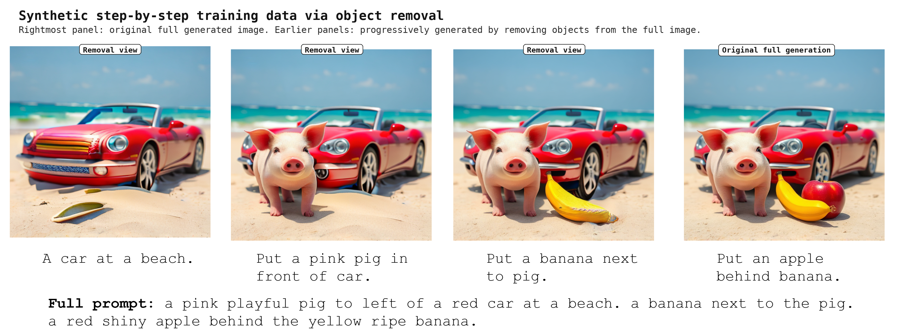
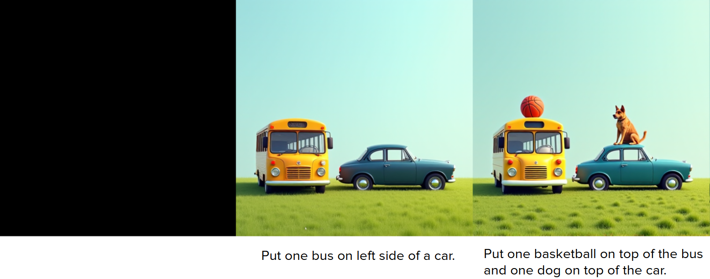
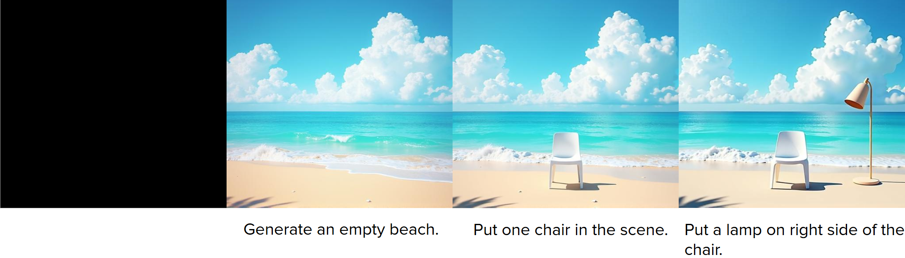

# Training-Based Image Generation

This directory contains code for the training-based step-by-step image generation approach.

Current contents:

- `synthetic_data_creation/`: FLUX + Grounded-SAM2 + VQAScore + Qwen-Image-Edit pipeline for creating step-by-step image editing training pairs.
- `model_training_scripts/x-flux/`: FLUX LoRA/full finetuning code for training the step-by-step image-conditioned model.

The data generation stage outputs flat training triples:

```text
{id}_condition.png
{id}.png
{id}.json
```

These are consumed by the image-to-image FLUX training code.

## Train The Step-By-Step Model

```bash
cd image_gen/train_step_by_step_model/model_training_scripts/x-flux
bash setup.sh
micromamba activate iter-refine-xflux

bash scripts/launch_step_by_step_lora_training.sh \
  train_configs/step_by_step_lora_channel_concat.yaml
```

The training code supports two image-conditioning modes through `conditioning_mode` in the config:

- `channel_concat`: default/recommended condition-image latent adapter with projection into FLUX image tokens.
- `token_concat`: experimental condition-token concatenation before the FLUX blocks.

See `model_training_scripts/x-flux/README.md` for full setup, config, and checkpoint details.

## Training Data Example



The rightmost panel is the original full image generated from the full prompt. The other panels are progressively generated by removing objects from that original image, giving intermediate condition images and prompts for step-by-step training.

## Trained Model Generations

Example generations from a trained step-by-step FLUX LoRA model:

| Example 1 |
| --- |
|  |

| Example 2 |
| --- |
|  |
