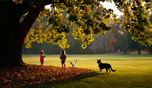
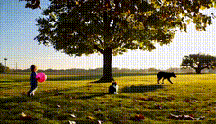

# Iterative Refinement for Compositional Video Generation

Code for running iterative refinement and step-by-step compositional video generation.

**Note:** The video generation pipeline is experimental. It is included to reproduce and explore the compositional video setting, but video editor quality can vary substantially across prompts,  model checkpoints and the iterative breakdown. Currently, simple object addition, deletion or modification seems to work all right, but more complex editing leads to poor video outputs. As better video editing models are released, one can plug them in to the framework. 

The runner supports two methods:

1. `iterative_parallel`: generate a video from the full prompt, verify it, ask a VLM critic for the next edit/regeneration action, and repeat.
2. `step_by_step_parallel`: ask a VLM/LLM to split the prompt into a core generation prompt plus a short list of add-step edits, then verify/refine each stage. This mode has internal refinement after the core generation and after every planned add step.


Empirically, `step_by_step_parallel` shows better performance as video editors currently are not as good at making major edits as they are in adding new objects and fixing minor errors.


The video backend used by the research scripts is:

- **Base generator:** Wan2.1 or [Wan2.2](https://github.com/Wan-Video/Wan2.2) text-to-video Gradio server.
- **Editor:** [UniVideo](https://github.com/KlingAIResearch/UniVideo) video-edit Gradio server. 

## Examples

Example outputs are included under `outputs/sample_outputs/`. The examples below show representative compositional prompts and the final output from our iterative refinement method.

| Baseline | Iterative Refinement |
| --- | --- |
| [](outputs/sample_outputs/case_1_knight_castle_horse_bird/parallel/sample_0.mp4) | [](outputs/sample_outputs/case_1_knight_castle_horse_bird/trajectory_0/step_4_add2.mp4) |

<p><sub><b>Prompt:</b> A knight walking to a castle carrying a sword. A dragon emitting flames from its mouth sits on top of the castle. A red bird flying in the background. A white horse walking on left of the knight.</sub></p>

| Baseline | Iterative Refinement |
| --- | --- |
| [](outputs/sample_outputs/case_2_garden_rabbit_butterfly/parallel/sample_0.mp4) | [](outputs/sample_outputs/case_2_garden_rabbit_butterfly/trajectory_0/step_2_add1.mp4) |

<p><sub><b>Prompt:</b> A woman is watering flowers in garden while rabbit watches and yellow butterfly flies around.</sub></p>

| Baseline | Iterative Refinement |
| --- | --- |
| [](outputs/sample_outputs/case_3_child_tree_dog_cat/parallel/sample_0.mp4) | [](outputs/sample_outputs/case_3_child_tree_dog_cat/trajectory_0/step_2_add1.mp4) |

<p><sub><b>Prompt:</b> A child walks toward a tree holding a ball. A dog walks to the right of the child. A cat sits under the tree and starts walking towards the dog.</sub></p>

<details>
<summary>Step-by-step trace: knight, castle, horse, and red bird</summary>

| Step | Instruction | Video |
| --- | --- | --- |
| 0 | Original generation | [MP4](outputs/sample_outputs/case_1_knight_castle_horse_bird/trajectory_0/step_0_core.mp4) |
| 1 | Add a white horse walking on left of the knight. | [MP4](outputs/sample_outputs/case_1_knight_castle_horse_bird/trajectory_0/step_2_add1.mp4) |
| 2 | Add a red bird flying in the background. | [MP4](outputs/sample_outputs/case_1_knight_castle_horse_bird/trajectory_0/step_4_add2.mp4) |

</details>

<details>
<summary>Step-by-step trace: garden, rabbit, and butterfly</summary>

| Step | Instruction | Video |
| --- | --- | --- |
| 0 | Original generation | [MP4](outputs/sample_outputs/case_2_garden_rabbit_butterfly/trajectory_0/step_0_core.mp4) |
| 1 | Add a yellow butterfly flying around the garden. | [MP4](outputs/sample_outputs/case_2_garden_rabbit_butterfly/trajectory_0/step_2_add1.mp4) |

</details>

<details>
<summary>Step-by-step trace: child, tree, dog, and cat</summary>

| Step | Instruction | Video |
| --- | --- | --- |
| 0 | Original generation | [MP4](outputs/sample_outputs/case_3_child_tree_dog_cat/trajectory_0/step_0_core.mp4) |
| 1 | Add a cat sitting calmly under the tree in the shade and then walking towards the dog. | [MP4](outputs/sample_outputs/case_3_child_tree_dog_cat/trajectory_0/step_2_add1.mp4) |

</details>

Additional sample outputs are available under `outputs/sample_outputs/`.

## Install

```bash
cd video_gen/inference_time_iterative_refinement
bash setup.sh
micromamba activate iterative-video-gen
```

For local `transformers` Qwen3-VL support:

```bash
INSTALL_EXTRAS=local bash setup.sh iterative-video-gen-local
micromamba activate iterative-video-gen-local
```

## API Keys

Set only the keys needed by the providers you use:

```bash
export GEMINI_API_KEY=...
export OPENAI_API_KEY=...
export OPENROUTER_API_KEY=...
export QWEN3VL_API_KEY=...
```

Do not put secrets in configs for public release. Use `api_key_env`.

## Start Video Servers

The runner expects external Gradio servers.

Wan T2V default:

```bash
export WAN_T2V_BASE_URL=http://localhost:8861
```

Wan2.2 T2V configs use a separate env var by default:

```bash
export WAN22_T2V_BASE_URL=http://localhost:8871
```

UniVideo edit default:

```bash
export UNIVIDEO_EDIT_BASE_URL=http://localhost:9861
```

On the current cluster, the older batch scripts used port pairs like:

```text
Wan2.1 T2V: 8860, 8861, 8862, 8863
Wan2.2 T2V: use any free port, for example 8871
UniVideo edit: 9860, 9861, 9862, 9863
```

The release client assumes the hosted Wan server exposes the same Gradio endpoint shape used by the original scripts:

```text
/gradio_api/call/predict
[prompt, resolution, num_frames, num_steps, guidance_scale, flow_shift, seed, negative_prompt, output_path]
```

Wan2.2's public repository provides `generate.py` and model weights; if your Wan2.2 server wrapper uses a different payload, adapt `iterative_video_gen/video_providers.py` or keep the wrapper compatible with the payload above.

Check the configured endpoints:

```bash
bash scripts/check_servers.sh
```

## Quick Run

Gemini verifier/critic:

```bash
iterative-video-gen run \
  --config configs/wan_univideo_gemini.yaml \
  --prompt "A knight walks toward a castle carrying a sword. A dragon sits on top of the castle breathing flames. A red bird flies in the background. A white horse walks on the left of the knight." \
  --iterations 3 \
  --parallel 2 \
  --output-dir outputs/demo_gemini
```

GPT verifier/critic on sampled frames. The GPT configs default to `gpt-5.2`, so the model override flags below are optional unless you want to change models:

```bash
iterative-video-gen run \
  --config configs/wan_univideo_gpt.yaml \
  --prompt "A child walks from left to right holding a red balloon. A dog walks behind the child. A blue car drives in the background. A bird flies above the balloon." \
  --iterations 3 \
  --parallel 2 \
  --output-dir outputs/demo_gpt
```

Wan2.2 T2V + UniVideo edit:

```bash
export WAN22_T2V_BASE_URL=http://localhost:8871

iterative-video-gen run \
  --config configs/wan22_univideo_gemini.yaml \
  --prompt "A knight walks toward a castle carrying a sword. A dragon sits on top of the castle breathing flames. A red bird flies in the background. A white horse walks on the left of the knight." \
  --parallel 2 \
  --output-dir outputs/demo_wan22
```

## Run Options

Important controls:

- `run.mode` / `--mode`: `step_by_step`, `step_by_step_parallel`, `iterative`, `iterative_parallel`, `parallel`, or `all`.
- `run.iterations` / `--iterations`: max video calls per iterative trajectory, including the initial generation. In `step_by_step` modes, a CLI `--iterations` value also sets `method.max_refine_per_step` unless `--max-refine-per-step` is explicitly provided. In `parallel` mode, the one-shot baseline uses `iterations * parallel` samples.
- `run.parallel` / `--parallel`: number of independent streams.
- `run.max_workers` / `--max-workers`: maximum concurrent streams/samples. Defaults to `parallel`.
- `method.plan_prompt_style` / `--plan-prompt-style`: `embellished` or `simple` for the step-by-step planner.
- `method.max_add_steps` / `--max-add-steps`: hard cap on planned add-step edits after the core generation. Default: `2`.
- `method.max_refine_per_step` / `--max-refine-per-step`: refinement attempts after the core generation and each add step.
- `questions.auto` / `--auto-questions` / `--no-auto-questions`: whether to generate yes/no verifier questions when none are provided.
- `models.generator`: base video generator provider/model/URL.
- `models.editor`: video editor provider/model/URL.
- `models.critic`: VLM used for question generation, planning, and feedback/edit decisions.
- `models.verifier`: VLM used inside the refinement loop.
- `models.eval_verifier`: optional test-time verifier used only for final rescoring/selection.

Step-by-step budget:

- The planner produces `1` core generation prompt plus up to `method.max_add_steps` add-step prompts.
- The core stage can run up to `method.max_refine_per_step` internal refinements/resamples after the initial core generation.
- Each add step performs one edit, then can run up to `method.max_refine_per_step` internal refinements/retries.
- Max video calls per stream is therefore:

```text
1 + max_refine_per_step + max_add_steps * (1 + max_refine_per_step)
```

With defaults `max_add_steps=2` and `max_refine_per_step=2`, the cap is `1 + 2 + 2 * 3 = 9` video calls per stream.

Concurrency behavior:

- Steps inside a stream are sequential because each edit depends on the previous video and verifier scores.
- Independent streams from `--parallel N` run concurrently up to `--max-workers`.
- One-shot baseline samples in `--mode parallel` also run concurrently up to `--max-workers`.
- Final eval-verifier scoring is currently sequential.

## VLM Providers

Supported provider names:

- `mock`: deterministic offline provider for smoke tests only.
- `gemini`: native video input by default. Set `use_native_video: false` or pass `--critic-frame-input` / `--verifier-frame-input` to use sampled frames.
- `gpt`: OpenAI chat-completions compatible; receives sampled JPEG frames.
- `openrouter`: OpenRouter chat-completions compatible; receives sampled JPEG frames.
- `qwen3vl`: OpenAI-compatible endpoint by default, or `backend: transformers` for local Transformers.

Frame controls:

```yaml
models:
  verifier:
    provider: gpt
    model: gpt-5.2
    api_key_env: OPENAI_API_KEY
    num_frames: 8
```

## Video Model Config

Wan T2V generation payload:

```yaml
generation:
  resolution: "832*480"
  num_frames: 37
  num_steps: 50
  guidance_scale: 6.0
  flow_shift: 8.0
  negative_prompt: ""
```

Wan2.2 example generation config:

```yaml
models:
  generator:
    provider: wan2.2-t2v-gradio
    model: Wan2.2-T2V-A14B
    base_url: ${WAN22_T2V_BASE_URL:-http://localhost:8871}

generation:
  resolution: "832*480"  # also supports 1280*720 / 720*1280 when hosted
  num_frames: 37
  num_steps: 40
  guidance_scale: 4.0
  flow_shift: 12.0
```

Available Wan generator provider aliases:

```text
wan-t2v-gradio
wan2.1-t2v-gradio
wan2.2-t2v-gradio
wan22-t2v-gradio
```

UniVideo edit payload:

```yaml
editing:
  num_frames: 37
  num_steps: 50
  height: 480
  width: 832
  guidance_scale: 7.0
  image_guidance_scale: 2.0  # higher, e.g. 3.0, preserves the source more strongly
  timestep_shift: 7.0
  teacache_thresh: 0
  negative_prompt: ""
```

The legacy aliases from the original scripts still work: `cfg_scale` maps to
`guidance_scale`, `edit_strength` maps to `image_guidance_scale`, and `cfg_txt`
maps to `timestep_shift`.

Override endpoints from the CLI:

```bash
iterative-video-gen run \
  --config configs/wan_univideo_gemini.yaml \
  --generator-base-url http://localhost:8860 \
  --editor-base-url http://localhost:9860 \
  --prompt "..." \
  --output-dir outputs/port0_run
```

## CLI Overrides

The main CLI arguments are:

```text
--prompt
--config
--mode
--iterations
--parallel
--max-workers
--output-dir
--seed
--plan-prompt-style
--max-add-steps
--max-refine-per-step
--resolution
--num-frames
--num-steps
--guidance-scale
--flow-shift
--negative-prompt
--edit-num-frames
--edit-num-steps
--height
--width
--edit-guidance-scale
--image-guidance-scale
--timestep-shift
--teacache-thresh
--cfg-scale
--edit-strength
--cfg-txt
--edit-negative-prompt
--start-frame
--base-generator
--generator-model
--generator-base-url
--editor
--editor-model
--editor-base-url
--critic-provider
--critic-model
--critic-base-url
--critic-api-key-env
--critic-num-frames
--critic-frame-input
--critic-native-video
--verifier-provider
--verifier-model
--verifier-base-url
--verifier-api-key-env
--verifier-num-frames
--verifier-frame-input
--verifier-native-video
--eval-verifier-provider
--eval-verifier-model
--eval-verifier-base-url
--eval-verifier-api-key-env
--eval-verifier-num-frames
--no-eval-verifier
--questions
--questions-file
--auto-questions
--no-auto-questions
```

Use `iterative-video-gen run --help` for the exact parser choices.

## Outputs

Each run writes:

- `config.resolved.json`: resolved config with secrets redacted.
- `questions.json`: verifier questions.
- `plan.json`: step-by-step plan, when applicable.
- `trajectory_N/trajectory.json`: per-stream videos, prompts, actions, raw VLM responses, and scores.
- `summary.json`: aggregate best candidate and optional eval-verifier result.

## Smoke Test

`configs/smoke_mock.yaml` is intended for no-key plumbing checks. It expects a local Gradio-compatible endpoint and uses the deterministic `mock` VLM provider, so it validates CLI/config/output handling without testing model quality.

Example:

```bash
SMOKE_GRADIO_BASE_URL=http://localhost:8899 \
iterative-video-gen run \
  --config configs/smoke_mock.yaml \
  --prompt "A knight walking outdoors." \
  --output-dir outputs/smoke_mock
```
